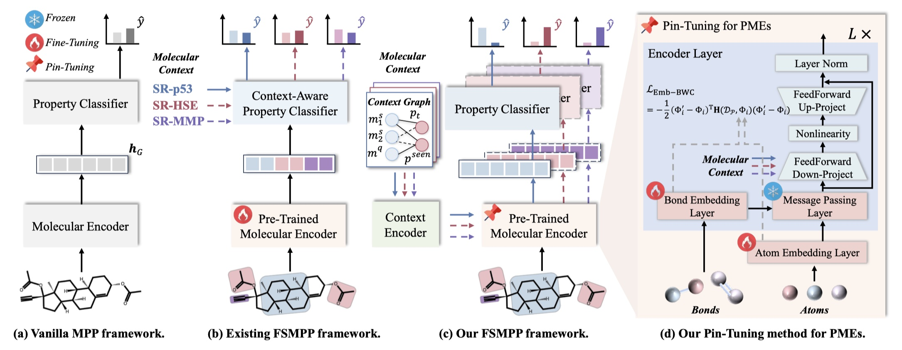

# Pin-Tuning: Parameter-Efficient In-Context Tuning for Few-shot Molecular Property Prediction



Implementation for paper: Pin-Tuning: Parameter-Efficient In-Context Tuning for Few-shot Molecular Property Prediction

This is the code for the NeurIP'24 Paper: [Pin-Tuning: Parameter-Efficient In-Context Tuning for Few-shot Molecular Property Prediction](https://arxiv.org/abs/2411.01158).


## Usage

For data used in the experiments, please download `data.zip` from [this page](https://github.com/HICAI-ZJU/GS-Meta/releases), then extract the downloaded file and save the contents in the `./data/` directory.

For quick start, you could run the scripts in the `./scripts/` directory using the following command. Make sure to modify the GPU ID in the scripts according to your actual setup.

```bash
sh scripts/10shot/run_<dataset_name>.sh # for 10-shot setting
# example: sh scripts/10shot/run_tox21.sh

sh scripts/5shot/run_<dataset_name>.sh # for 5-shot setting
# example: sh scripts/5shot/run_sider.sh
```
Supported datasets:
*  `tox21`, `sider`, `muv`,` pcba`
* `toxcast-APR`,`toxcast-ATG`,`toxcast-BSK`, `toxcast-CEETOX`,`toxcast-CLD`,`toxcast-NVS`, `toxcast-OT`,`toxcast-TOX21`,`toxcast-Tanguay`

## Requirements

* Python >= 3.9
* PyTorch >= 1.12.1 
* torch_geometric >= 2.3.1
* torch_scatter==2.1.0
* rdkit==2023.3.3
* learn2learn==0.2.0
* numpy==1.26.4
* scikit_learn==1.4.0
* seaborn==0.13.2
* tqdm==4.66.1

## Citation

Please cite our paper if you use the code:

```
@inproceedings{wang2024pintuning,
  author       = {Liang Wang and Qiang Liu and Shaozhen Liu and Xin Sun and Shu Wu and Liang Wang},
  title        = {Pin-Tuning: Parameter-Efficient In-Context Tuning for Few-Shot Molecular Property Prediction},
  booktitle    = {NeurIPS},
  year         = {2024}
}
```
